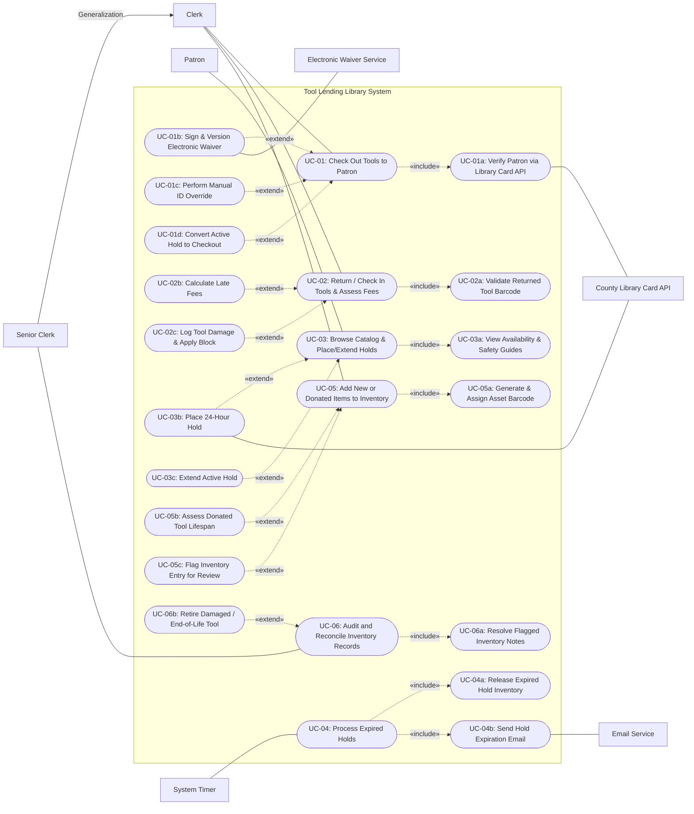

```mermaid
flowchart LR
    %% Primary Actors
    Patron["Patron"]
    Clerk["Clerk"]
    SeniorClerk["Senior Clerk"]
    Timer["System Timer"]

    %% Secondary Actors
    CardAPI["County Library Card API"]
    WaiverSys["Electronic Waiver Service"]
    EmailSys["Email Service"]

    subgraph System ["Tool Lending Library System"]
        %% UC-01 & Sub-cases
        UC01(["UC-01: Check Out Tools to Patron"])
        UC01a(["UC-01a: Verify Patron via Library Card API"])
        UC01b(["UC-01b: Sign & Version Electronic Waiver"])
        UC01c(["UC-01c: Perform Manual ID Override"])
        UC01d(["UC-01d: Convert Active Hold to Checkout"])

        %% UC-02 & Sub-cases
        UC02(["UC-02: Return / Check In Tools & Assess Fees"])
        UC02a(["UC-02a: Validate Returned Tool Barcode"])
        UC02b(["UC-02b: Calculate Late Fees"])
        UC02c(["UC-02c: Log Tool Damage & Apply Block"])

        %% UC-03 & Sub-cases
        UC03(["UC-03: Browse Catalog & Place/Extend Holds"])
        UC03a(["UC-03a: View Availability & Safety Guides"])
        UC03b(["UC-03b: Place 24-Hour Hold"])
        UC03c(["UC-03c: Extend Active Hold"])

        %% UC-04 & Sub-cases
        UC04(["UC-04: Process Expired Holds"])
        UC04a(["UC-04a: Release Expired Hold Inventory"])
        UC04b(["UC-04b: Send Hold Expiration Email"])

        %% UC-05 & Sub-cases
        UC05(["UC-05: Add New or Donated Items to Inventory"])
        UC05a(["UC-05a: Generate & Assign Asset Barcode"])
        UC05b(["UC-05b: Assess Donated Tool Lifespan"])
        UC05c(["UC-05c: Flag Inventory Entry for Review"])

        %% UC-06 & Sub-cases
        UC06(["UC-06: Audit and Reconcile Inventory Records"])
        UC06a(["UC-06a: Resolve Flagged Inventory Notes"])
        UC06b(["UC-06b: Retire Damaged / End-of-Life Tool"])
    end

    %% Actor Inheritance
    SeniorClerk -->|Generalization| Clerk

    %% Primary Actor Associations
    Patron --- UC03
    Clerk --- UC01
    Clerk --- UC02
    Clerk --- UC05
    SeniorClerk --- UC06
    Timer --- UC04

    %% Include / Extend Relationships (Remember: extend points FROM extension TO base)
    UC01 -.->|«include»| UC01a
    UC01b -.->|«extend»| UC01
    UC01c -.->|«extend»| UC01
    UC01d -.->|«extend»| UC01

    UC02 -.->|«include»| UC02a
    UC02b -.->|«extend»| UC02
    UC02c -.->|«extend»| UC02

    UC03 -.->|«include»| UC03a
    UC03b -.->|«extend»| UC03
    UC03c -.->|«extend»| UC03

    UC04 -.->|«include»| UC04a
    UC04 -.->|«include»| UC04b

    UC05 -.->|«include»| UC05a
    UC05b -.->|«extend»| UC05
    UC05c -.->|«extend»| UC05

    UC06 -.->|«include»| UC06a
    UC06b -.->|«extend»| UC06

    %% Secondary Actor Associations
    UC01a --- CardAPI
    UC03b --- CardAPI
    UC01b --- WaiverSys
    UC04b --- EmailSys
```